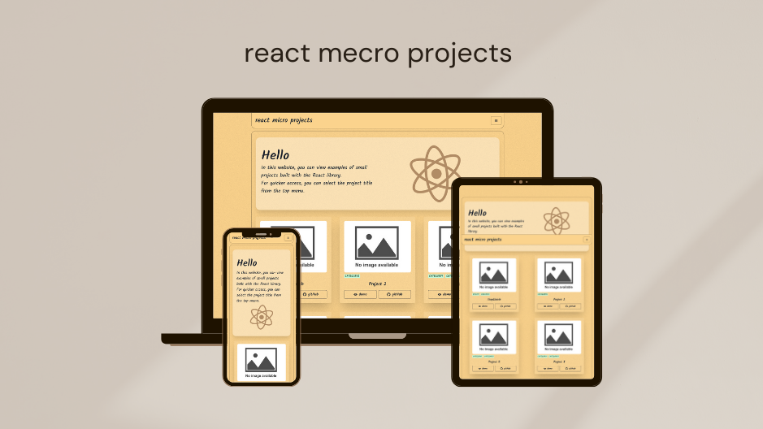

<div align="center">
  <h2 align="center">react-micro-projects</h2>

The react-micro-project repository is a collection of small code snippets, <br />designed for use in larger projects with the React library.

<a href="https://react-micro-projects.netlify.app/"><strong>➥ Live Demo</strong></a>

</div>

<br />

### Demo Screeshots



### Prerequisites

Before you begin, ensure you have met the following requirements:

- [Git](https://git-scm.com/downloads "Download Git") must be installed on your operating system.

### Run Locally

To run **react-micro-projects** locally, run this command on your git bash:

Linux and macOS:

```bash
sudo git clone https://github.com/Afshin-Shoja/react-micro-projects.git
```

Windows:

```bash
git clone https://github.com/Afshin-Shoja/react-micro-projects.git
```

After clone run this code :

```bash
npm install
```

then :

```bash
npm run dev
```

### Contact

If you want to contact with me you can reach me at [Linkdin](https://www.linkedin.com/in/afshin-shoja-9bb33822b/).

### License

This project is **free to use** and does not contains any license.


  <!-- 
  
  [](https://twitter.com/intent/follow?screen_name=codewithsadee)
  [](https://youtu.be/9ts7JnruWg4) -->
  <br />
